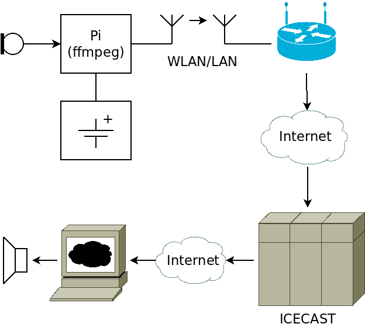

# SpyMic

Rasperry Pi based microphone audio streaming to an icecast server. Requires icecast server somewhere in the internet.

Actually the original purpose of this was to make my vinyl recordplayer available in the whole household, but spymic sounds better.

